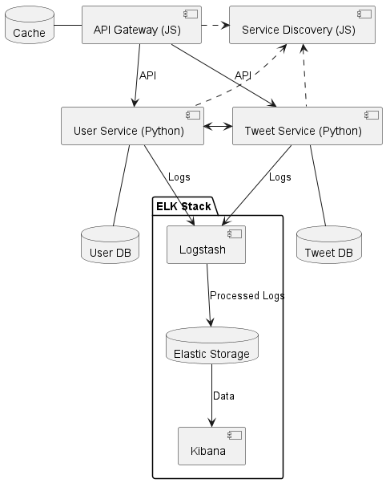
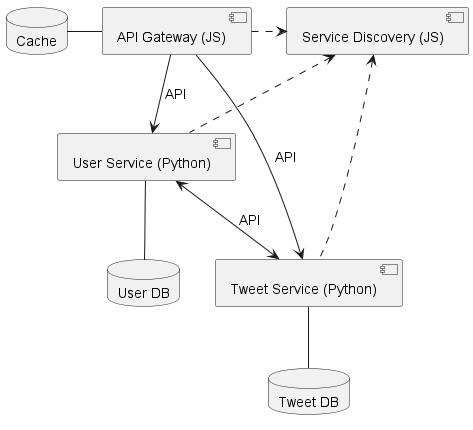

# How to run this project?

1) `git clone` this repository.
2) With a command line navigate to the `faf202-purici-marius-pad-lab1/`.
3) Run the command `docker compose up` (Please wait 30seconds, the user service and the tweet service wait for the database to be in healthy state before starting).
4) The `gateway` service will be running on port `8030`. Also it has Swagger configured, therefore all the endpoints will be available in there. (Visit Swagger page at `localhost:8030/docs`)

# Updated System Architecture for Lab 2

# Twitter like Social Media platform - Post Updates, Subscribe to people you know, Receive their updates

This project aims to implement a simplified version of a Twitter-like system using a microservices architecture. The system is composed of two main services: the User Service, which handles user registration, authentication, and follow management; and the Tweet Service, which handles tweet creation, deletion, and retrieval of home and user timelines. The services are implemented in Python using the FastAPI framework, and they communicate with each other via RESTful APIs. The system also includes an API Gateway and a Service Discovery component, both implemented in JavaScript with Express.js. The API Gateway routes client requests to the appropriate service, while the Service Discovery component maintains a record of the network locations of service instances.

## Assess Application Suitability

I believe that a microservice architecture would be suitable for a **Twitter-like** system for the following reasons:

1. **Complexity**: Such an application has multiple components (**User Service**, **Tweet Service** - are defined below) that have distinct responsibilities. This complexity makes it a good fit for a microservices architecture, where each service can be developed and maintained independently.
2. **Scalability**: Each component of such an application may have different scalability requirements. For example, the **Tweet Service** might need to handle a high load of tweet creation requests, while the **User Service** might have less load. With microservices, it is possible to scale each service independently based on its needs.
3. **Development Speed and Agility**: With microservices, each service can be developed, tested, and deployed independently. This allows for faster development and more agility in responding to changes or new requirements.
4. **Fault Isolation**: In a microservices architecture, if one service fails, it doesn’t bring down the entire application. This is particularly important for an application where you wouldn’t want a failure in the Tweet Service to affect the User Service, or vice versa.

As for real-world examples, **Twitter** itself transitioned from a **monolithic architecture** to a **microservices architecture** as they scaled. They broke down their monolithic application into several services including **Tweet Service**, **User Service**, **Timeline Service**, and many others. This transition allowed them to handle their massive user base and tweet volume more effectively.

**Facebook**, another giant social-media platform, uses a **microservices architecture** to handle its massive scale and complexity. Facebook’s backend system is organized around a distributed "social graph" that stores all user data. To serve billions of reads and millions of writes per second, Facebook is able to scale its services independently.

These examples align well with the proposed Twitter-like system where different functionalities are separated into different services.

## Define Service Boundaries

In the context of my **Twitter-like** system, I have identified two main services: the **User Service** and the **Tweet Service**. Here are their responsibilities:

1. **User Service**: This service is responsible for user-related operations. Its main functionalities include:
    
    * **User Registration**: Registering new users in the system.
    * **User Authentication**: Authenticating users when they log in.
    * **Follow Management**: This functionality allows users to follow and unfollow other users. When a user follows another user, they subscribe to their tweets. The main operations include:
        
        * **Follow a User**: A user can choose to follow another user. When User A follows User B, User A will see User B’s tweets in their home timeline.
        * **Unfollow a User**: A user can also choose to unfollow another user. When User A unfollows User B, User B’s tweets will no longer appear in User A’s home timeline.
        * **List of Followings**: The system should be able to provide a list of all the users that a given user is following.
        * **List of Followers**: The system should also be able to provide a list of all the users that are following a given user.

2. **Tweet Service**: This service is responsible for tweet-related operations. Its main functionalities include:

    * **Tweet Creation**: Posting new tweets.
    * **Tweet Deletion**: Deleting existing tweets.
    * **Home Timeline**: Retrieving the recent tweets from the users that a given user is following. This would involve interacting with the **User Service** to get the list of users that the current user is following.
    * **User Timeline**: Retrieving all the tweets that a specific user has tweeted.

### System Architecture Diagram

## Choose Technology Stack and Communication Patterns

When planning my **Twitter-like** system I made the following decisions:

* **Technology Stack**:

    * **API Gateway**: JavaScript with Express.js. This gateway will handle requests from clients, route them to the appropriate service, and return the response. JavaScript is a versatile language that’s widely used for web development. Express.js is a minimal and flexible Node.js web application framework that provides robust features for web applications.

    * **User Service**: Python with FastAPI. This service will handle user registration, authentication, and follow management. Python is a versatile language that’s great for web development. FastAPI is a modern, fast (high-performance), web framework for building APIs with Python 3.6+ based on standard Python type hints.

    * **Tweet Service**: Python with FastAPI. This service will handle tweet creation, deletion, and retrieval of home and user timelines.

* **Communication Patterns**:

    * **RESTful APIs**: Each service will expose a RESTful API which will be used for inter-service communication. RESTful APIs are stateless, meaning each request from the client to server must contain all the information needed to understand and process the request. This aligns well with the principles of microservices, where each service is independent and can be developed, deployed, and scaled separately.

## Design Data Management

Each service is going to have its own database. For both services, I plan on using relational databases (at the time of writing I haven't decided on the specific RDBMS). Since I have decided that inter-service communication will be enabled by the **RESTful API** the service provides, here is a list of potential endpoints for each service along with the data that would be transferred:

<!-- maybe remove stuff related to user authentication and registration -->
`The teacher suggested to remove endpoints related to user authentication and registration.`

* **User Service**: 
    1. `POST /users/register`
        * Request Body: `{ "username": string, "password": string }`
        * Response Body: `{ "userId": string, "username": string }`
    2. `POST /users/login`
        * Request Body: `{ "username": string, "password": string }`
        * Response Body: `{ "userId": string, "username": string, "accessToken": string }`
    3. `POST /users/{userId}/follow`
        * Request Body: `{ "followUserId": string }`
        * Response Body: `{ "message": string }`
    4. `DELETE /users/{userId}/unfollow`
        * Request Body: `{ "unfollowUserId": string }`
        * Response Body: `{ "message": string }`
    5. `GET /users/{userId}/followings`
        * Response Body: `{ "followings": [string] }`
    6. `GET /users/{userId}/followers`
        * Response Body: `{ "followers": [string] }`

* **Tweet Service**
    1. `POST /tweets`
        * Request Body: `{ "userId": string, "content": string }`
        * Response Body: `{ "tweetId": string, "userId": string, "content": string, "timestamp": string }`
    2. `DELETE /tweets/{tweetId}`
        * Response Body: `{ "message": string }`
    3. `GET /tweets/homeTimeline/{userId}`
        * Response Body: `{ "tweets": [{"tweetId": string, "userId": string, "content": string, "timestamp": string}] }`
    4. `GET /tweets/userTimeline/{userId}`
        * Response Body: `{ "tweets": [{"tweetId": string, "userId": string, "content": string, "timestamp": string}] }`

## Set Up Deployment and Scaling

Regarding containerization, I decided that I am going to use **Docker**. **Docker** provides the ability to package and run an application in a loosely isolated environment called a container. Setting up deployment and scaling is a key aspect of implementing microservices. For the orchestration and scaling part I would try to go with the **Docker Compose** tool, since I am a lot more familiar with it compared to **Kubernetes**. However, since **Docker Compose** is primarily a development tool and might not be suitable for production environments, I might decide that **Kubernetes** is a better alternative for this purpose.
